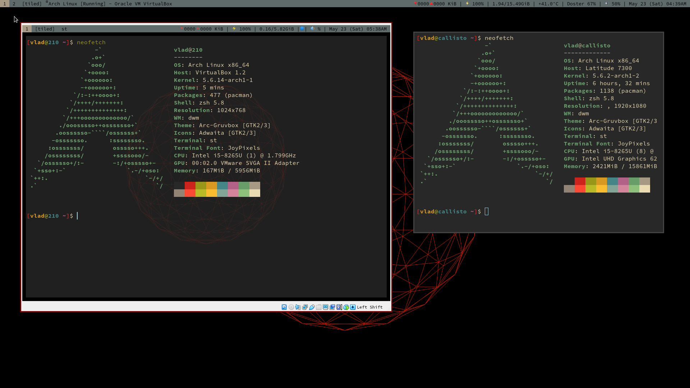

## ***Personal system installer***

An everyday desktop evironment geared towards **productivity**,  **software development**,  **low resource usage**, and **reproducibility**.

### Included:

1. Arch Linux installer asks for input, has sensible defaults, and does the heavy lifting for you.
    - Uses [systemd-boot](https://wiki.archlinux.org/index.php/systemd-boot) boot manager
    - Seperate root/user partitions
    - Default swap partition size based on system RAM
2. Dotfile installer sets up fully configured system using [Suckless utilities](https://suckless.org/).
    - [Dynamic window manager](https://dwm.suckless.org/)
    - [Dynamic menu](https://tools.suckless.org/dmenu/)
    - [Simple Terminal](https://st.suckless.org/)

### Installation:

**cURL & run the wizard**:
```bash
$ curl -LO files.vdoster.com/wizard.sh
$ sudo bash ./wizard.sh
```

#### `user-programs.csv` list

Parses the given programs list and installs them.

The first column is a "tag" that determines how the program is installed.


- Blank if package in main repository.
- `A` -> Packages contained in the AUR.
- `G` -> Git repositories installed by `make && sudo make install`.
- `P` -> Python packages installed via `pip`.


#### Check which programs arent installed:

```bash
$ programs="https://raw.githubusercontent.com/vladdoster/dotfile-installer/master/user-programs.csv"
$ printf "\n" && echo "$(curl -s "$programs" | sed '/^#/d')" | \
  while IFS=, read -r tag program comment; do
   if [[ $tag == 'G' ]]; then
       printf "$program might not be installed because it is from git\n"
   else
       printf "$(pacman -Qi "$program" > /dev/null)"
   fi;  done
```

## Screenshot
Running on laptop and virtual box concurrently.



## TODO:
    [ ]: Make swap default based on system RAM
    [ ]: Don't break Windows if trying to dual boot
